# OSS Knowledge Embedding Server - GitOps Deployment

이 문서는 OSS Knowledge Embedding Server의 GitOps 기반 배포에 대한 가이드입니다.

## 🏗️ GitOps 아키텍처

### 저장소 구조

```
📦 oss-knowledge-embedding-back (이 저장소)
├── app/                          # 애플리케이션 소스 코드
├── Dockerfile                    # Docker 이미지 빌드
├── .gitlab-ci.yml               # CI/CD 파이프라인
└── requirements.txt             # Python 의존성

📦 oss-knowledge-gitops (별도 저장소)
└── backend/embedding-server/
    ├── base/                    # 기본 K8s 매니페스트
    │   ├── namespace.yaml
    │   ├── deployment.yaml
    │   ├── service.yaml
    │   ├── ingress.yaml
    │   └── kustomization.yaml
    └── overlays/               # 환경별 오버레이
        ├── dev/                # 개발 환경
        └── prod/               # 운영 환경
```

## 🚀 서비스 정보

### 애플리케이션 구성

-   **서비스 이름**: OSS Knowledge Embedding Server
-   **포트**: 8000
-   **프로토콜**: HTTP/REST API
-   **언어**: Python (FastAPI)

### 주요 기능

-   📄 **Excel/PDF/Markdown 파일 처리**: 다양한 형식의 문서 파싱
-   🧠 **Azure OpenAI 임베딩**: 3072차원 벡터 생성
-   ⚙️ **지능형 청킹**: 계층적 구조 인식 분할
-   🔍 **시맨틱 검색**: 의미 기반 유사도 검색
-   📊 **벡터/그래프 저장**: Qdrant + Neo4j 연동

## 🌐 배포 환경

### 개발 환경 (Development)

-   **네임스페이스**: `oss-knowledge-backend-dev`
-   **URL**: http://oss-knowledge-embedding-dev.4.230.158.187.nip.io
-   **복제본**: 1개
-   **리소스**: 512Mi RAM, 250m CPU (최대 2Gi RAM, 1000m CPU)
-   **로그 레벨**: DEBUG
-   **의존성**: dev-qdrant, dev-neo4j

### 운영 환경 (Production)

-   **네임스페이스**: `oss-knowledge-backend-prod`
-   **URL**: http://oss-knowledge-embedding.4.230.158.187.nip.io
-   **복제본**: 2개 (고가용성)
-   **리소스**: 2Gi RAM, 1000m CPU (최대 8Gi RAM, 4000m CPU)
-   **로그 레벨**: INFO
-   **의존성**: qdrant, neo4j

## 📋 배포 플로우

### 1. 코드 변경 → 자동 빌드

```mermaid
graph LR
    A[코드 푸시] --> B[GitLab CI/CD]
    B --> C[테스트]
    C --> D[Docker 빌드]
    D --> E[이미지 푸시]
```



### 2. GitOps 배포 플로우

```mermaid
graph LR
    E[이미지 레지스트리] --> F[GitOps 저장소]
    F --> G[ArgoCD 동기화]
    G --> H[Kubernetes 배포]
```



### 3. 배포 방법

#### 자동 배포 (GitLab CI/CD)

```bash
# 1. 코드 변경 후 푸시
git add .
git commit -m "feat: new feature"
git push origin main

# 2. GitLab에서 수동으로 배포 작업 실행
# - Pipeline > deploy:dev 또는 deploy:prod 클릭
```

#### 수동 배포 (GitOps 저장소에서)

```bash
# GitOps 저장소에서 실행
kubectl apply -k backend/embedding-server/overlays/dev/
kubectl apply -k backend/embedding-server/overlays/prod/
```

## 🐳 Docker 이미지

### 빌드

```bash
# 이미지 빌드
docker build -t oss-knowledge-embedding-server:latest .

# 개발 환경용 태그
docker tag oss-knowledge-embedding-server:latest oss-knowledge-embedding-server:dev

# 운영 환경용 태그
docker tag oss-knowledge-embedding-server:latest oss-knowledge-embedding-server:v1.0.0
```

### 환경 변수

| 변수명               | 기본값                         | 설명                           |
| -------------------- | ------------------------------ | ------------------------------ |
| APP_NAME             | OSS Knowledge Embedding Server | 애플리케이션 이름              |
| DEBUG                | false                          | 디버그 모드                    |
| LOG_LEVEL            | INFO                           | 로그 레벨                      |
| HOST                 | 0.0.0.0                        | 바인드 호스트                  |
| PORT                 | 8000                           | 서비스 포트                    |
| QDRANT_URL           | http://qdrant:6333             | Qdrant 벡터 DB URL             |
| NEO4J_URI            | neo4j://neo4j:7687             | Neo4j 그래프 DB URI            |
| NEO4J_USERNAME       | neo4j                          | Neo4j 사용자명                 |
| NEO4J_PASSWORD       | password                       | Neo4j 비밀번호                 |
| EMBEDDING_DEVICE     | cpu                            | 임베딩 디바이스 (cpu/cuda/mps) |
| EMBEDDING_MODEL      | text-embedding-3-large         | Azure OpenAI 모델              |
| VECTOR_SIZE          | 3072                           | 벡터 차원 수                   |
| EMBEDDING_BATCH_SIZE | 32                             | 임베딩 배치 크기               |

## 📦 GitOps 저장소 설정 가이드

이 애플리케이션 저장소를 GitOps로 배포하려면 별도의 GitOps 저장소에 다음 Kubernetes 매니페스트들을 생성해야 합니다:

### GitOps 저장소 구조

```
📦 oss-knowledge-gitops/backend/embedding-server/
├── base/
│   ├── namespace.yaml
│   ├── deployment.yaml
│   ├── service.yaml
│   ├── ingress.yaml
│   ├── secret.yaml
│   └── kustomization.yaml
└── overlays/
    ├── dev/
    │   ├── kustomization.yaml
    │   └── deployment-patch.yaml
    └── prod/
        ├── kustomization.yaml
        └── deployment-patch.yaml
```

### 필수 매니페스트 파일들

#### base/namespace.yaml

```yaml
apiVersion: v1
kind: Namespace
metadata:
    name: oss-knowledge-backend-dev
---
apiVersion: v1
kind: Namespace
metadata:
    name: oss-knowledge-backend-prod
```

#### base/secret.yaml (Neo4j 인증)

```yaml
apiVersion: v1
kind: Secret
metadata:
    name: neo4j-auth
type: Opaque
data:
    username: bmVvNGo= # neo4j (base64)
    password: cGFzc3dvcmQ= # password (base64)
```

#### base/deployment.yaml

```yaml
apiVersion: apps/v1
kind: Deployment
metadata:
    name: embedding-server
    labels:
        app: embedding-server
spec:
    replicas: 1
    selector:
        matchLabels:
            app: embedding-server
    template:
        metadata:
            labels:
                app: embedding-server
        spec:
            containers:
                - name: embedding-server
                  image: registry.4.230.158.187.nip.io/oss-knowledge-embedding-server:latest
                  ports:
                      - containerPort: 8000
                  env:
                      - name: APP_NAME
                        value: "OSS Knowledge Embedding Server"
                      - name: DEBUG
                        value: "false"
                      - name: LOG_LEVEL
                        value: "INFO"
                      - name: HOST
                        value: "0.0.0.0"
                      - name: PORT
                        value: "8000"
                      - name: QDRANT_URL
                        value: "http://qdrant:6333"
                      - name: NEO4J_URI
                        value: "neo4j://neo4j:7687"
                      - name: NEO4J_USERNAME
                        valueFrom:
                            secretKeyRef:
                                name: neo4j-auth
                                key: username
                      - name: NEO4J_PASSWORD
                        valueFrom:
                            secretKeyRef:
                                name: neo4j-auth
                                key: password
                  resources:
                      requests:
                          memory: "512Mi"
                          cpu: "250m"
                      limits:
                          memory: "2Gi"
                          cpu: "1000m"
                  livenessProbe:
                      httpGet:
                          path: /health
                          port: 8000
                      initialDelaySeconds: 30
                      periodSeconds: 30
                  readinessProbe:
                      httpGet:
                          path: /health
                          port: 8000
                      initialDelaySeconds: 5
                      periodSeconds: 5
```

#### base/service.yaml

```yaml
apiVersion: v1
kind: Service
metadata:
    name: embedding-server
spec:
    selector:
        app: embedding-server
    ports:
        - port: 8000
          targetPort: 8000
    type: ClusterIP
```

#### base/ingress.yaml

```yaml
apiVersion: networking.k8s.io/v1
kind: Ingress
metadata:
    name: embedding-server
    annotations:
        nginx.ingress.kubernetes.io/rewrite-target: /
spec:
    rules:
        - host: oss-knowledge-embedding.4.230.158.187.nip.io
          http:
              paths:
                  - path: /
                    pathType: Prefix
                    backend:
                        service:
                            name: embedding-server
                            port:
                                number: 8000
```

#### overlays/dev/kustomization.yaml

```yaml
apiVersion: kustomize.config.k8s.io/v1beta1
kind: Kustomization
namespace: oss-knowledge-backend-dev
resources:
    - ../../base
namePrefix: dev-
patches:
    - deployment-patch.yaml
```

#### overlays/prod/kustomization.yaml

```yaml
apiVersion: kustomize.config.k8s.io/v1beta1
kind: Kustomization
namespace: oss-knowledge-backend-prod
resources:
    - ../../base
patches:
    - deployment-patch.yaml
```

### ArgoCD 애플리케이션 설정

GitOps 저장소에 ArgoCD 애플리케이션도 추가하세요:

```yaml
apiVersion: argoproj.io/v1alpha1
kind: Application
metadata:
    name: oss-knowledge-embedding-server-dev
    namespace: argocd
spec:
    project: default
    source:
        repoURL: http://gitlab.4.230.158.187.nip.io/82291936/oss-knowledge-gitops
        targetRevision: HEAD
        path: backend/embedding-server/overlays/dev
    destination:
        server: https://kubernetes.default.svc
        namespace: oss-knowledge-backend-dev
    syncPolicy:
        automated:
            prune: true
            selfHeal: true
```

## 🔧 의존성 서비스

### Qdrant (벡터 데이터베이스)

-   **포트**: 6333
-   **용도**: 임베딩 벡터 저장 및 유사도 검색
-   **설정**: `file_chunks` 컬렉션 사용

### Neo4j (그래프 데이터베이스)

-   **포트**: 7687
-   **용도**: 문서 간 관계 저장 및 그래프 검색
-   **인증**: Secret을 통한 사용자명/비밀번호 관리

## 🔍 헬스체크 및 모니터링

### 헬스체크 엔드포인트

-   **URL**: `/health`
-   **응답**: 서비스 상태 및 의존성 확인

### 주요 API 엔드포인트

-   `GET /` - 서비스 정보
-   `GET /docs` - API 문서 (개발 환경만)
-   `POST /process/excel` - Excel 파일 처리
-   `POST /markdown/process` - Markdown 처리
-   `POST /search/similarity` - 시맨틱 검색

## 🔒 보안 설정

### 시크릿 관리

```yaml
# Neo4j 인증 정보 (base64 인코딩)
apiVersion: v1
kind: Secret
metadata:
    name: neo4j-auth
data:
    username: bmVvNGo= # neo4j
    password: cGFzc3dvcmQ= # password
```

### CORS 설정

-   모든 Origin 허용 (개발용)
-   운영 환경에서는 특정 도메인으로 제한 권장

## 📊 리소스 요구사항

### 최소 요구사항

-   **CPU**: 250m (개발) / 1000m (운영)
-   **Memory**: 512Mi (개발) / 2Gi (운영)
-   **Storage**: 임시 데이터용 EmptyDir 볼륨

### 권장 요구사항

-   **CPU**: 1000m (개발) / 4000m (운영)
-   **Memory**: 2Gi (개발) / 8Gi (운영)
-   **GPU**: CUDA 호환 GPU (임베딩 가속화 시)

## 🚨 문제 해결

### 일반적인 문제들

1. **이미지 Pull 실패**

    ```bash
    # 이미지가 존재하는지 확인
    docker images | grep oss-knowledge-embedding-server
    ```

2. **의존성 서비스 연결 실패**

    ```bash
    # Qdrant/Neo4j 서비스 상태 확인
    kubectl get svc -n oss-knowledge-backend-dev
    ```

3. **메모리 부족**
    ```bash
    # Pod 리소스 사용량 확인
    kubectl top pod -n oss-knowledge-backend-dev
    ```

### 로그 확인

```bash
# 개발 환경 로그 확인
kubectl logs -f deployment/dev-embedding-server -n oss-knowledge-backend-dev

# 운영 환경 로그 확인
kubectl logs -f deployment/embedding-server -n oss-knowledge-backend-prod
```

## 📞 지원

배포 관련 문의사항이 있으시면 개발팀에 연락해주세요.

-   GitLab Repository: http://gitlab.4.230.158.187.nip.io/82291936/oss-knowledge-embedding-back
-   ArgoCD Dashboard: ArgoCD 웹 인터페이스에서 애플리케이션 상태 확인
